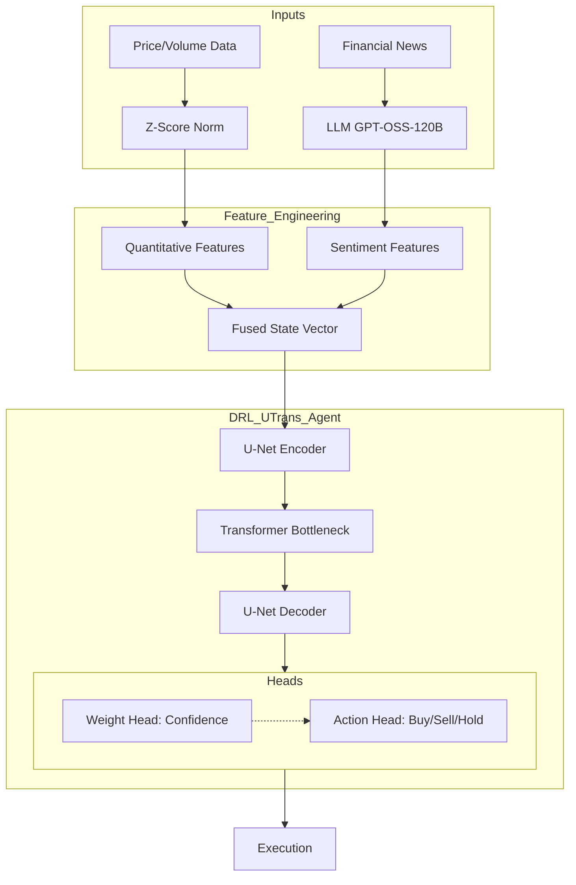

# Language of the Markets: Deep Reinforcement Learning for Algorithmic Trading with Multimodal LLM Sentiment Fusion

> **Can we generate "alpha" (excess returns) by giving a Deep Reinforcement Learning (DRL) agent the ability to "read" the news alongside "watching" the charts?**

This project presents a multimodal trading system that integrates quantitative market data (price, volume, technical indicators) with qualitative sentiment features derived from Large Language Models (LLMs).


## Executive Summary

The core research question was whether LLM-derived sentiment could act as a powerful, orthogonal signal to improve risk-adjusted returns. The results demonstrate that **news headline sentiment improves risk-adjusted returns (Sharpe Ratio) by ~15%** and acts as a regulariser to stabilize DRL training. Conversely, using LLMs to summarize technical indicators was found to introduce noise and redundancy.

### Key Achievements

- **Alpha Generation**: The Headline-LLM agent significantly outperformed the Buy & Hold benchmark and baseline strategies.
- **Stability**: News sentiment reduced run-to-run variance by 3x, grounding the agent's policy.
- **Rigorous Methodology**: Validated across 10 diverse stocks with realistic transaction costs (10bps) and strict out-of-sample testing.

## Technical Architecture

### The DRL Agent: DRL-UTrans

A state-of-the-art, custom neural network architecture designed specifically for financial time-series.

- **Backbone**: Hybrid U-Net + Transformer.
  - **U-Net Encoder**: Captures multi-scale temporal patterns.
  - **Transformer Bottleneck**: Uses self-attention for long-range dependencies and "market memory".
  - **U-Net Decoder**: Retains fine-grained signal details.
- **Dual-Head Output**:
  1.  **Action Head (Discrete)**: Buy, Sell, or Hold.
  2.  **Weight Head (Continuous)**: Position sizing confidence $\in [0,1]$.



### Multimodal Feature Engineering Pipeline

1.  **Quantitative Channel**:
    - Source: Yahoo Finance (OHLCV).
    - Features: MACD, RSI, KDJ, Open-Close diff.
    - Normalization: Z-score normalization (fit on train, transformed on test).
2.  **Qualitative Channel**:
    - Source: FNSPID (1.2M+ Financial News Headlines).
    - Engine: gpt-oss-120b via Groq API.
    - Signal: Aggregated daily statistics (mean, std dev, max absolute score, count) of news sentiment.

### The Trading Environment

- **Type**: Single-stock trading environment.
- **Frictions**: 0.1% (10bps) transaction costs.
- **Reward Function**: Position-aware reward accounting for realized PnL and mark-to-market value.

## Experimental Methodology

A rigorous ablation study was conducted to isolate the contribution of each feature set:

| Experiment             | Description                                     |
| :--------------------- | :---------------------------------------------- |
| **I (Baseline)**       | Quantitative features only (Control).           |
| **II (Indicator-LLM)** | Baseline + LLM summary of technical indicators. |
| **III (Headline-LLM)** | Baseline + News Sentiment features.             |
| **IV (Combined)**      | All features.                                   |

**Rigour Checklist**:

- **Data Split**: Strict 70/30 chronological split.
- **Seeding**: 3 distinct random seeds per experiment.
- **Universe**: Tested across 10 diverse stocks (e.g., NVDA, KO, GE, JPM).

## Key Results & Insights

1.  **News contains "Alpha"**: The Headline-LLM agent achieved the highest average Sharpe Ratio (0.59) and Sortino Ratio (0.87).
2.  **Redundancy Hurts**: The Indicator-LLM agent performed worse than the baseline, proving that LLM summarization of math adds noise.
3.  **Stability**: The Headline-LLM agent showed 3x less variance, suggesting narrative data acts as a "regulariser".

## Installation & Usage

### Prerequisites

- Python 3.8+
- PyTorch 2.0+

### Installation

```bash
pip install -r requirements.txt
```

### Running Experiments

The `main.py` script orchestrates the ablation study. You can configure seeds and tickers in `config.py`.

```bash
python main.py
```

This will:

1.  Train agents for all defined run types and seeds.
2.  Evaluate them on out-of-sample data.
3.  Generate results in the `results/` directory, including:
    - `manifest.json`: Full experiment metadata.
    - `summary.csv`: Aggregate metrics.
    - `plots/`: Equity curves.

## Codebase Structure

- **`main.py`**: Orchestrator for the ablation study, model selection, and reproducibility.
- **`config.py`**: Central configuration for seeds, tickers, and paths.
- **`drl_utrans/models/utrans.py`**: PyTorch implementation of the custom U-Net + Transformer architecture.
- **`drl_utrans/agent/`**: DRL logic (DQN-based) handling Replay Buffer and Bellman updates.
- **`evaluate.py`**: Out-of-sample testing and financial metric calculation.

---

_This project was developed as part of a Master's Dissertation at UCL._
